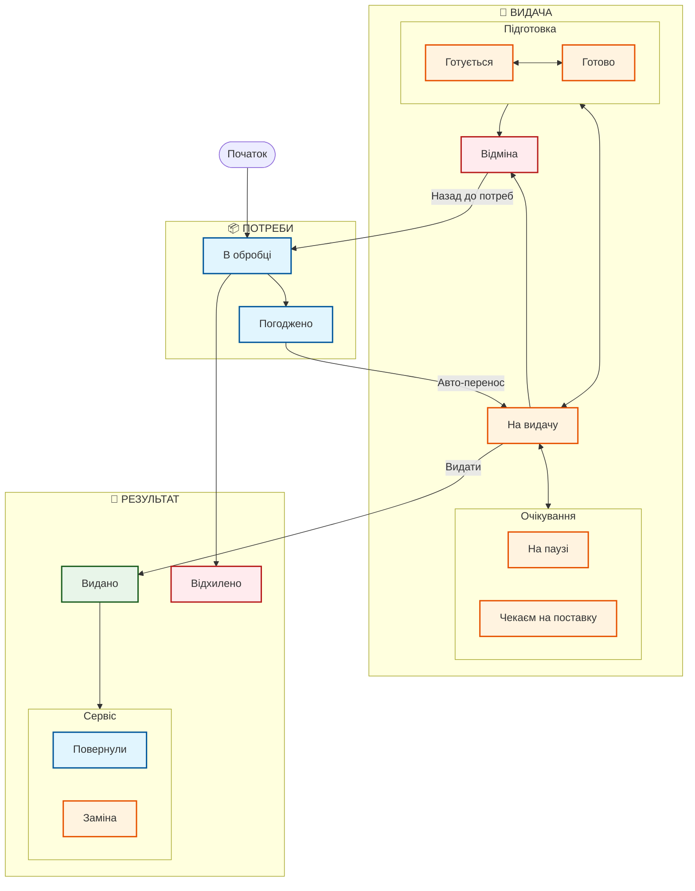

# Діаграма переходів статусів (Status Transitions)

> [!TIP]
> Якщо ваша програма перегляду Markdown не підтримує Mermaid (ви бачите лише текст), ви можете:
> 1. Відкрити файл `STATUS_TRANSITIONS.html` у будь-якому браузері.
> 2. Переглянути цей файл на GitHub (там він рендериться автоматично).

Цей документ описує логіку руху заявок між статусами та таблицями в системі.

## Граф переходів

## Опис логіки

### 1. Етап "Потреба" (Needs)
- **В обробці:** Початковий стан будь-якої нової заявки.
- **Погоджено:** Після погодження запис автоматично переноситься у вкладку **"Видача"**.
- **Відхилено:** Запис переноситься у вкладку **"Відхилені"** з обов'язковим вказанням причини.

### 2. Етап "Видача" (Issuance)
- **На видачу:** Статус за замовчуванням для нових записів у цій вкладці.
- **Готується / Готово:** Проміжні технічні статуси для комплектації чи налаштування техніки.
- **Чекаєм на поставку / На паузі:** Статуси очікування зовнішніх факторів.
- **Відміна:** Критичний статус. Видаляє запис із видачі та повертає його в **"Потреби"** для перегляду.

### 3. Результуючі стани
- **Видано:** Кінцевий успішний статус.
- **Повернули:** Якщо майно було повернуто на склад після видачі.
- **Заміна:** Якщо майно потребує заміни через несправність чи інші причини.
